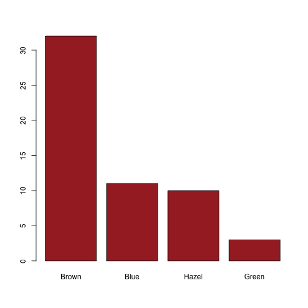

Shiny App: Hair/Eye color statistics
========================================================
author: Ajith.K.H
date: 28 February 2016

Overview Hair/Eye color statistics App
========================================================

This application was created to illustrate distribution of hair and eye color and sex for students.

The application was built as part of a deliverable for the course project for producing Shiny Application and reproducible pitch.

Shiny application is available in 

Source code is avaiable in 


Slide With Code
========================================================


```r
summary(cars)
```

```
     speed           dist       
 Min.   : 4.0   Min.   :  2.00  
 1st Qu.:12.0   1st Qu.: 26.00  
 Median :15.0   Median : 36.00  
 Mean   :15.4   Mean   : 42.98  
 3rd Qu.:19.0   3rd Qu.: 56.00  
 Max.   :25.0   Max.   :120.00  
```

Slide With Plot
========================================================


